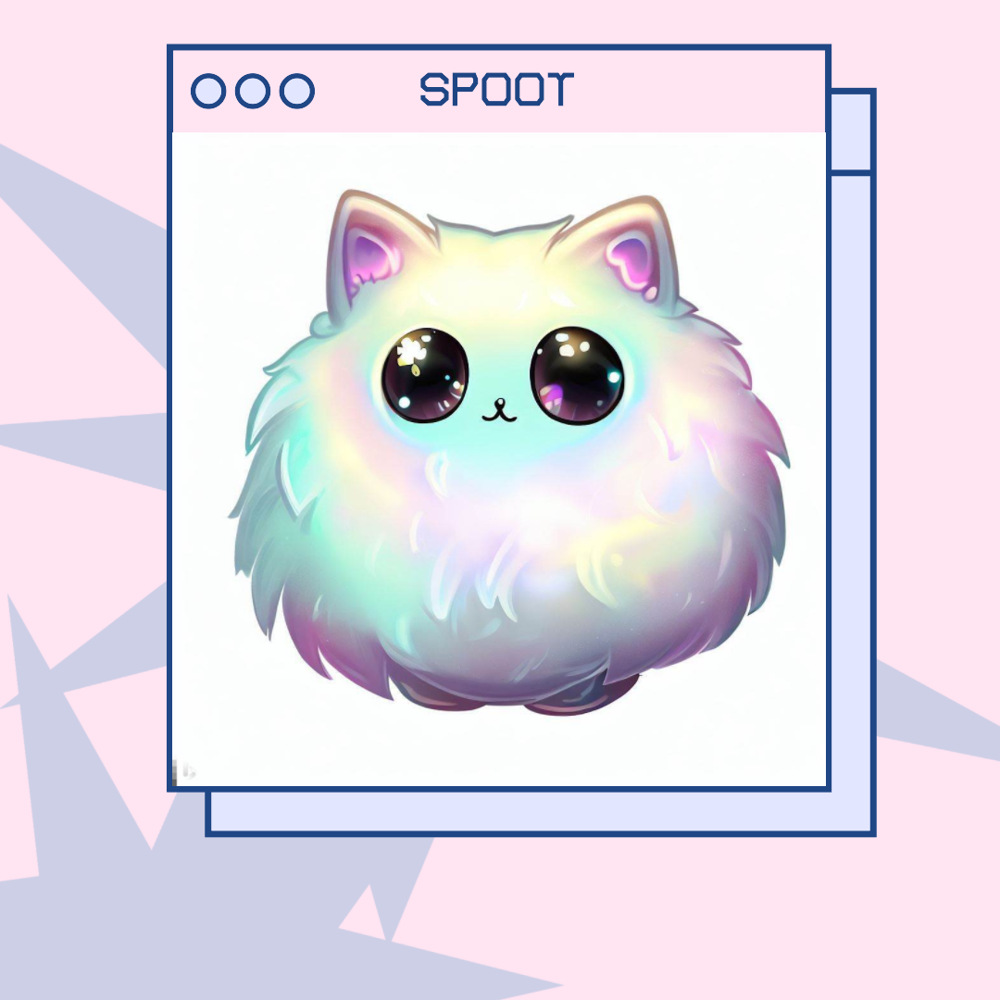

<!----------------------------------------------------------------------------
| Oliver Sigwarth                                                            |
| Computer Programming (CIDS 162)                                            |
| Assignment Three: The Magical Object Oriented Spoot                        |
| File: README.md                                                            |
| Description:                                                               |
|----------------------------------------------------------------------------|
| In this assignment, you will create a Java program to explore the concepts |
| of basic classes, constructors, getters, and setters. Instead of using     |
| real-world entities, you will design a class hierarchy representing        |
| imaginary creatures called Spoots. These Spoots will have specific         |
| attributes such as name, color and age. Your objective is to demonstrate   |
| your understanding of class design and object-oriented programming         |
| concepts by implementing the Spoot class.                                  |
|----------------------------------------------------------------------------|
| Created: 8/15/2023                                                         |
| Last Modified: 8/18/2023                                                   |
----------------------------------------------------------------------------->

<!----------------------------------------------------------------------------
| 4b. Write a header comment at the beginning of each file, including your   |
|     name and a brief description of the assignment.                        |
|----------------------------------------------------------------------------|
| 4. Documentation.                                                          |
----------------------------------------------------------------------------->

<!-----------------------------------Title----------------------------------->
# The _Magical_ Object-Oriented Spoot!

### By Oliver Sigwarth

---
<!-------------------------Introduction/Description-------------------------->
The Spoot is an amazing imaginary creature that can be many different names,
colors, and abilities. The Spoot is a magical creature that can be a good tool
for learning about object-oriented programming. The Spoot exists in a 
hierarchy of classes that can be used to show Java's ability to have 
independent and shared attributes. Please enjoy your visit to the Spoot 
Factory and perhaps you will find yourself understanding object-oriented
programming a little better.

<!--------------------------------Spoot-Image-------------------------------->
<div align="center">
  
  <!--MLA-Image-Citation-->
  <p style="font-size: 14px">
    Tomesh, Trevor. “Spoot.” 
    <em>Canvas</em>, Infrastructure, Inc, 12 Aug. 2023, <br>
    <a href=
       "https://uwrvf.instructure.com/courses/583559/files/63688750/preview">
       https://uwrvf.instructure.com/courses/583559/files/63688750/preview
    </a>.
     &nbsp;
Accessed 18 Aug. 2023.
  </p>
</div>

---
<!-----------------------------Table-of-Contents----------------------------->

## Table of Contents
- [Introduction](#introduction)
- [Getting Started](#getting-started)
- [Installation](#installation)
- [Usage](#usage)
- [Configuration](#configuration)
- [Contributing](#contributing)
- [License](#license)


### Table of Contents
Must have:
- Project name (h1)
- Project description (p?)
- Table of Contents (h2)
  - Introduction
  - Getting Started
  - Installation
    - Command line method
  - Usage
  - Configuration
  - Contributing
  - License


### 

To run the Spoot program, please follow these instructions:
To execute run_spoot_factory.sh, type into the console 
```chmod +x run_spoot_factory.sh```
and then
```./run_spoot_factory.sh.```
If you installed the program correctly, the program will launch and you will
be greeted with a welcome message. If you did not install the program
correctly, you will be given an error message.

<!----------------------------------License---------------------------------->

### 📜 License - MIT License 📜

---
This project is licensed under the MIT License - see the 
[LICENSE.md](LICENSE.md) file for details